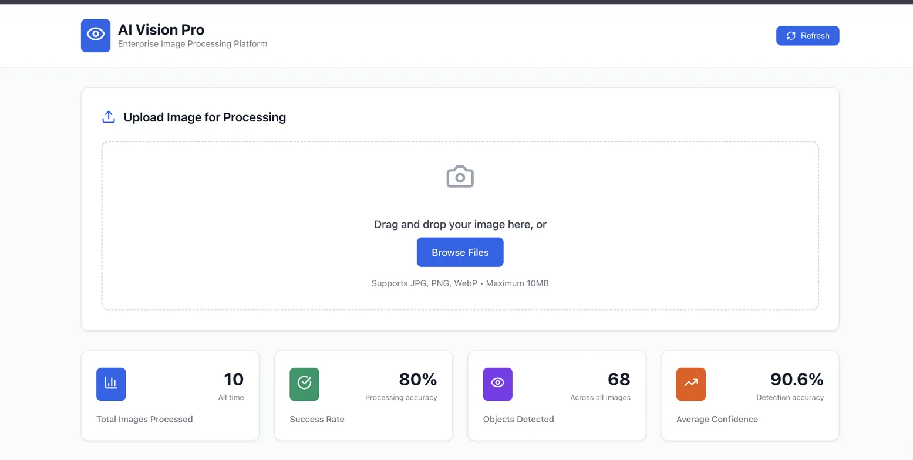
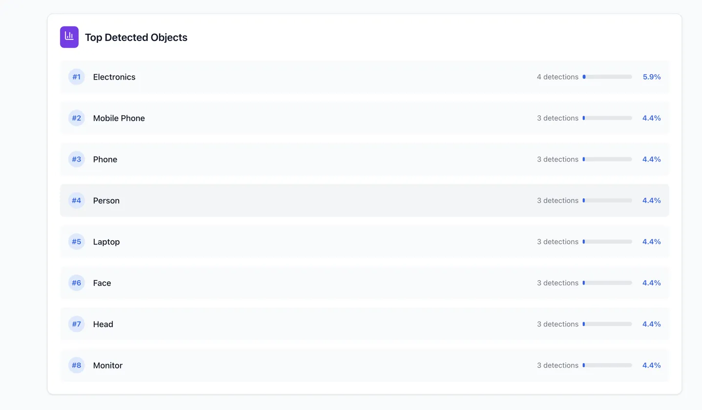
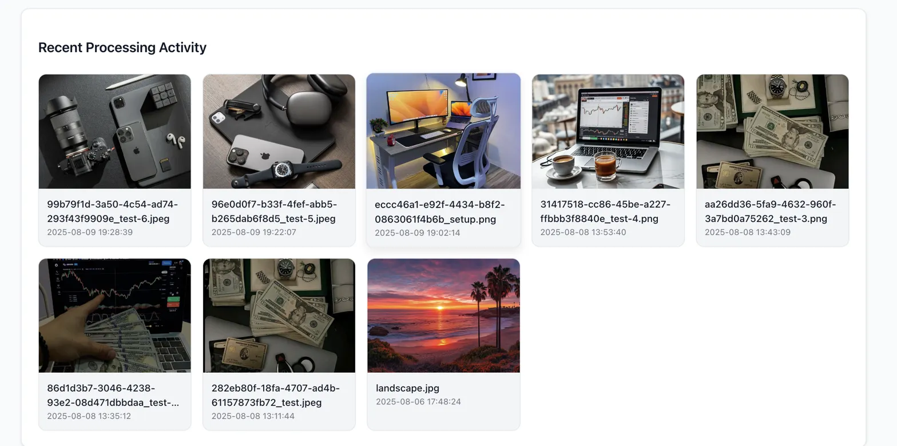
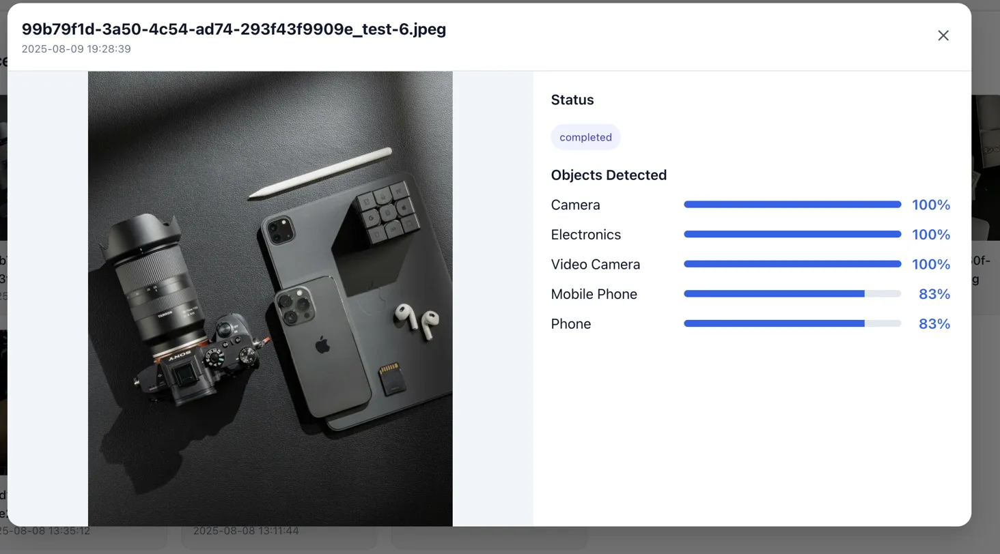

# AI Vision Pro - Serverless Image Processing Platform

A **serverless AI-powered image processing platform** built with AWS that provides enterprise-grade object detection and image analysis capabilities.

## Features

- **Smart Image Upload** - Drag & drop interface with real-time processing
- **Object Detection** - AI-powered detection with confidence scores
- **Analytics Dashboard** - Comprehensive metrics and insights
- **Real-time Processing** - Instant feedback on uploaded images
- **Detailed Image Results** - Click any processed image to view detection details
- **Interactive Modal View** - Full-size image preview with confidence percentages
- **Enterprise UI** - Professional dashboard designed for business use

---

## How to Use:

### 1️⃣ Upload Images
- **Drag & Drop**: Simply drag image files into the upload zone
- **Browse Files**: Click "Browse Files" to select images from your device
- **Supported Formats**: JPG, PNG, WebP (Max 10MB per file)

### 2️⃣ Monitor Processing
- **Real-time Progress**: Watch upload and processing status
- **Success Notifications**: Get instant feedback on completion
- **Auto-refresh**: Dashboard updates automatically with new results

### 3️⃣ View Analytics
- **Processing Stats**: See total images processed and success rates
- **Object Detection**: View most commonly detected objects
- **Confidence Scores**: Monitor AI detection accuracy

### 4️⃣ Explore Results
- **Recent Activity**: Browse all processed images in the grid
- **Click for Details**: Click any image to open detailed results modal
- **Individual Analysis**: View specific objects detected with confidence percentages
- **Processing Status**: See completion status for each image

### 5️⃣ Real-time Updates
- **Refresh Button**: Manual refresh for latest data
- **Auto-updates**: Recent uploads appear automatically
- **Live Metrics**: Analytics update as new images are processed

---

## Screenshots

### Dashboard Overview

*Clean, professional interface with drag & drop upload and real-time analytics*

### Object Detection Analytics

*AI-powered object detection with confidence scores and detailed analytics*

### Recent Processing Activity

*Visual grid showing processed images with timestamps and detection results*

### Detailed Image Results

*Click any processed image to view full-size preview with individual object confidence scores*

---

## Tech Stack

**Frontend:**
- React 18
- Vite
- Lucide React (Icons)
- Responsive Design (CSS-in-JS)

**Backend:**
- AWS Lambda (Serverless Functions)
- Amazon S3 (Image Storage)
- Amazon DynamoDB (Metadata Storage)
- API Gateway (REST API)
- AWS Rekognition (Object Detection)

**Infrastructure:**
- Serverless Architecture
- Auto-scaling
- 99.9% Uptime
- Cost-optimized

---

## Project Structure

```
.
├── api/                       # Backend lambda function handlers
├── dashboard/                 # React + TailwindCSS frontend
├── analyze_images.py          # Image processing script
├── aws-test.py               # AWS integration test
├── test_lambda.py            # Lambda function test
├── amplify.yaml              # Amplify build config
└── README.md                 # This file
```

---

## Quick Start

### Prerequisites
- Node.js 18+ and npm
- AWS Account with configured CLI
- Git

### 1️⃣ Clone the Repository
```bash
git clone https://github.com/your-username/ai-vision-pro.git
cd ai-vision-pro
```

### 2️⃣ Install Dependencies
```bash
cd dashboard
npm install
```

### 3️⃣ Environment Setup
Create a `.env` file in the `dashboard/` directory:
```env
VITE_API_BASE_URL=https://your-api-gateway-url.execute-api.us-east-1.amazonaws.com/prod
```

### 4️⃣ Run Development Server
```bash
cd dashboard
npm run dev
```

The application will be available at `http://localhost:5173`

### 5️⃣ Build for Production
```bash
cd dashboard
npm run build
```

---

## AWS Infrastructure Setup

### Required AWS Services
1. **API Gateway** - REST API endpoints
2. **Lambda Functions** - Serverless processing
3. **S3 Bucket** - Image storage
4. **DynamoDB** - Metadata storage
5. **Rekognition** - Object detection service

### Testing Scripts
- `analyze_images.py` - Standalone image processing script
- `aws-test.py` - AWS integration testing
- `test_lambda.py` - Lambda function testing

### Lambda Functions
- `POST /api/v1/images` - Upload and process images
- `GET /api/v1/images` - Retrieve processed images
- `GET /api/v1/analytics` - Get processing analytics

---

## API Endpoints

| Method | Endpoint | Description | Response |
|--------|----------|-------------|----------|
| `GET` | `/api/v1/analytics` | Get processing statistics | Analytics data |
| `GET` | `/api/v1/images` | List all processed images | Image array |
| `POST` | `/api/v1/images` | Upload new image | Processing result |

### Example API Response

**Analytics Endpoint:**
```json
{
  "processing_stats": {
    "total_processed": 45,
    "success_rate": 98
  },
  "object_detection": {
    "total_objects_detected": 156,
    "average_confidence": 94,
    "top_objects": [
      {
        "name": "person",
        "count": 23,
        "percentage": 15.2
      }
    ]
  }
}
```

**Images Endpoint:**
```json
{
  "images": [
    {
      "filename": "example.jpg",
      "timestamp": "2025-01-15T10:30:00Z",
      "processing_status": "success",
      "detected_objects": [
        {
          "name": "car",
          "confidence": 96.5
        }
      ]
    }
  ]
}
```

---

## UI Components

### Dashboard Features
- **Header** - Brand identity with refresh functionality
- **Upload Zone** - Drag & drop file upload with progress tracking
- **Analytics Cards** - Key metrics display with real-time data
- **Object Detection Chart** - Top detected objects with progress bars
- **Recent Activity Grid** - Processed images with status indicators
- **Image Details Modal** - Click any image for detailed analysis view
- **Footer** - Clean branding

### Interactive Features
- **Drag & Drop Upload** - Seamless file upload experience
- **Real-time Progress** - Visual feedback during processing
- **Clickable Image Grid** - View detailed results for any processed image
- **Modal Image Viewer** - Full-size image with confidence percentages
- **Auto-refresh Data** - Latest analytics and processing results

### Responsive Design
- Mobile-first approach
- Tablet and desktop optimized
- Touch-friendly interactions
- Accessibility compliant

---

## Security & Performance

### Security Features
- File type validation (JPG, PNG, WebP)
- File size limits (10MB max)
- CORS enabled for frontend domain
- AWS IAM role-based permissions

### Performance Optimizations
- Serverless auto-scaling
- Image compression
- Lazy loading
- Efficient API calls
- CDN-ready static assets

---

## Monitoring & Analytics

### Built-in Metrics
- Total images processed
- Processing success rate
- Object detection accuracy
- Average confidence scores
- Popular detected objects

### AWS Monitoring
- CloudWatch logs
- Lambda execution metrics
- API Gateway analytics
- S3 usage tracking

---

## Deployment

### Frontend Deployment (AWS Amplify)
The project includes `amplify.yaml` configuration for automatic deployment:

```bash
cd dashboard
npm run build
# AWS Amplify will automatically deploy using amplify.yaml config
```

### AWS Lambda Deployment
```bash
# Package and deploy Lambda functions from api/ directory
cd api
zip -r lambda-function.zip .
# Upload to AWS Lambda via CLI or Console
```

### Test Your Setup
```bash
# Test AWS integration
python aws-test.py

# Test Lambda functions locally
python test_lambda.py

# Run image analysis
python analyze_images.py
```

---

## Testing

### Run Tests
```bash
npm run test
```

### Test Coverage
- Component rendering
- API integration
- File upload functionality
- Error handling

---

**Built using AWS Serverless Architecture**
